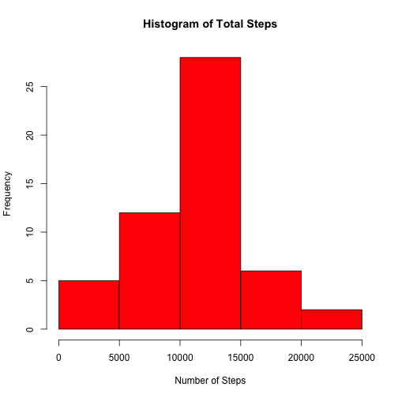
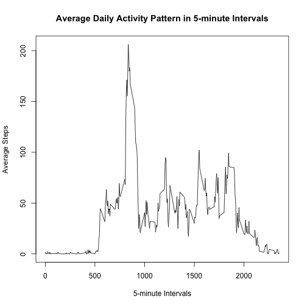
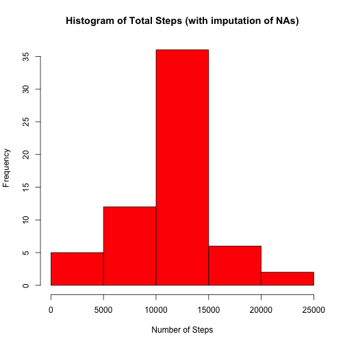
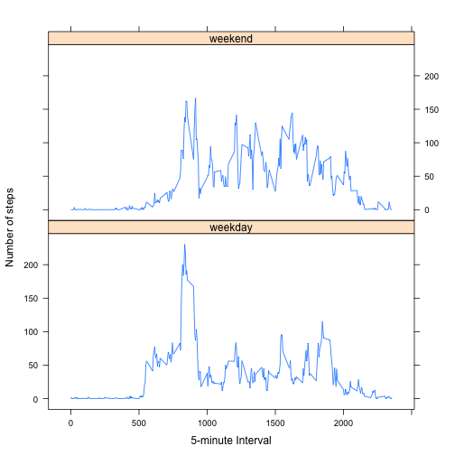

## Set Global options


```r
opts_chunk$set(echo=TRUE)
```

## Loading and preprocessing the data


```r
unzip("activity.zip")
DF <- read.csv("activity.csv", colClasses = c("integer", "Date", "factor"))
DF_noNA <- na.omit(DF)
str(DF)
```

```
## 'data.frame':	17568 obs. of  3 variables:
##  $ steps   : int  NA NA NA NA NA NA NA NA NA NA ...
##  $ date    : Date, format: "2012-10-01" "2012-10-01" ...
##  $ interval: Factor w/ 288 levels "0","10","100",..: 1 226 2 73 136 195 198 209 212 223 ...
```

## What is mean total number of steps taken per day?


```r
library(reshape)
totalSteps <- aggregate(DF_noNA$steps, list(Date = DF_noNA$date), FUN = "sum")
totalSteps <- rename(totalSteps, c(Date = "date", x = "total"))
hist(totalSteps$total, breaks = 5, col = "red", main = "Histogram of Total Steps", xlab = "Number of Steps", 
     ylab = "Frequency")
```

 

Mean and Median total steps:


```r
mean(totalSteps$total)
```

```
## [1] 10766.19
```

```r
median(totalSteps$total)
```

```
## [1] 10765
```

## What is the average daily activity pattern?


```r
avgSteps <- aggregate(DF_noNA$steps, list(interval = as.numeric(as.character(DF_noNA$interval))), FUN = "mean")
avgSteps <- rename(avgSteps, c(x = "meanOfSteps"))
plot(avgSteps$interval, avgSteps$meanOfSteps, type = "n",col = "red", main = "Average Daily Activity Pattern in 5-minute Intervals", xlab = "5-minute Intervals", ylab = "Average Steps")
lines(avgSteps$interval, avgSteps$meanOfSteps, type = "l")
```

 

5-minute Interval with maximum number of steps:


```r
avgSteps[avgSteps$meanOfSteps == max(avgSteps$meanOfSteps), ]
```

```
##     interval meanOfSteps
## 104      835    206.1698
```

## Imputing missing values

Total number of lines with NA values:


```r
sum(is.na(DF))
```

```
## [1] 2304
```

Devise a stategy for filling in missing values of dataset:


```r
DF1 <- DF 
for (i in 1:nrow(DF1)) {
    if (is.na(DF1$steps[i])) {
        DF1$steps[i] <- avgSteps[which(DF1$interval[i] == avgSteps$interval), ]$meanOfSteps
    }
}
```

Make histogram of total number of steps each day:


```r
library(reshape)
totalSteps2 <- aggregate(DF1$steps, list(Date = DF1$date), FUN = "sum")
totalSteps2 <- rename(totalSteps2, c(Date = "date", x = "total"))
hist(totalSteps2$total, breaks = 5, col = "red", main = "Histogram of Total Steps (with imputation of NAs)", xlab = "Number of Steps", ylab = "Frequency")
```

 

Mean and Median total steps with imputed values:


```r
mean(totalSteps2$total)
```

```
## [1] 10766.19
```

```r
median(totalSteps2$total)
```

```
## [1] 10766.19
```

Conclusion:
After imputing the missing values the means stay the same but the median increased slightly and is now equal to the mean.

## Are there differences in activity patterns between weekdays and weekends?

Create factor variable with weekday and weekend level:


```r
DF1$weekdays <- factor(format(DF1$date, "%A"))
levels(DF1$weekdays)
```

```
## [1] "Friday"    "Monday"    "Saturday"  "Sunday"    "Thursday"  "Tuesday"  
## [7] "Wednesday"
```

```r
levels(DF1$weekdays) <- list(weekday = c("Monday", "Tuesday",
                                             "Wednesday", 
                                             "Thursday", "Friday"),
                                 weekend = c("Saturday", "Sunday"))
levels(DF1$weekdays)
```

```
## [1] "weekday" "weekend"
```

```r
table(DF1$weekdays)
```

```
## 
## weekday weekend 
##   12960    4608
```


```r
avgSteps2 <- aggregate(DF1$steps, 
                      list(interval = as.numeric(as.character(DF1$interval)), 
                           weekdays = DF1$weekdays),
                      FUN = "mean")

avgSteps2  <- rename(avgSteps2 , c(x = "meanOfSteps"))

library(lattice)
xyplot(avgSteps2$meanOfSteps ~ avgSteps2$interval | avgSteps2$weekdays, 
       layout = c(1, 2), type = "l", 
       xlab = "5-minute Interval", ylab = "Number of steps")
```

 
